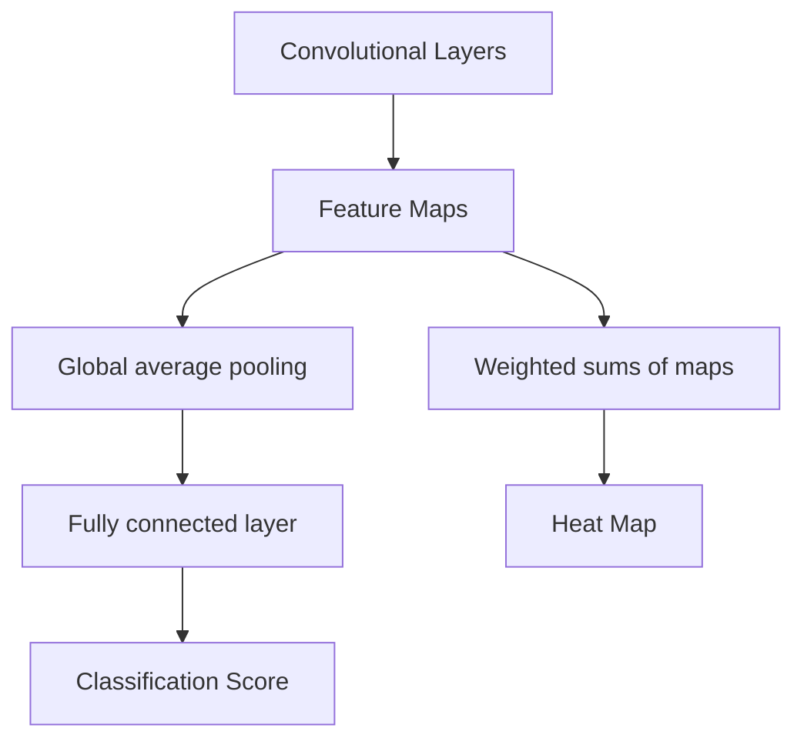

# Lec 19 : Model Activation Methords

## A breif recap of CNN

A CNN stands for **Convolutional Neural Network**. Mainly used for classification of images.

The general CNN, has multiple layers.
In the intial layer it tries to identify the simple features and as we go deeper , more harder features are identified.

**CNN filters** : they are smaller scale like (2x2, 4x4) etc, they identify features in the images. Example egdes.

Operations at each layer are the following
- Convalution
- Non linearity
- Pooling (Max or Mean)

> See the detials of these operations in the slides.
> Also refer : [Standford Cheatsheet](https://stanford.edu/~shervine/teaching/cs-230/cheatsheet-convolutional-neural-networks/)

---

## Class Activation Mapping (CAM)

How do we interpret and understand the the why a CNN model predicted a particular output?

**CAM** reuses the weights of the CNN-Model to plot heatmaps, which helps us to understand what pixels or super pixels features helped in the prediction.

>[!Note]
>CAM can have only one fully connected layer

### Step 1 : Global Average Pooling

$$
    F_k = \frac {1}{Z} \sum_{i,j} A_k(i,j)
$$

### Step 2 : Classification Score

$$
    y^c = \sum_k w_k^c \cdot F_k
$$

c : class
w : weights

### Step 3 : Heat Maps

$$
    M^c(i,j) = \sum_k w_k^c \cdot A_k(i,j)
$$

> the details of the variables in slide.
> Also refer : [Blog Post](https://johfischer.com/2022/01/27/class-activation-maps/)

> [!Note]
> CAMs are Local Model Specific approachs

---

