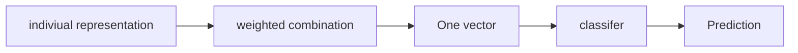

# Lec 24 : Attention is not Explaination

## Introduction

- Attention mechanisms are every where in NLP.
- Implicit assumption : high attention weight = word responsible for prediction

> [!QUESTION] Is this assumption actually true ?

> [!Note] This paper argues that this assumption is wrong.

### What is Attention

**Attention** = assigning different weights to different parts of input.

### Where do the hidden states come from ?

The encoder produces one contextual vector for each input position.

Each $h_t$ is contextual : it represents the word together with information.

**How are attention weights calculated ?**

$$
    h\alpha = \sum_t \alpha_t h_t
$$

---

## What would we expect if attention were an explanation ?

The Test are the following
1. **Agreement**  ( High attention -> High feature importance )
2. **Sensitivity** ( Change Attention -> Change Prediction )

If attention is indeed the explanation then it should hold for the above test.

### Test 1

The author compare attention with gradient based and leave one out importance measure. Then compare with attention value.

> Takeaway : high attention does not necesaryily mean high feature importance

### Test 2

The two attention maps tell very different stories , yet the prediction can remain the same.

The authors took made an adverserial to attention weight , which gave different attention map. But the prediction was same.

This happens as the sum , i.e the resultant one vector has the same value.

> Takeaway : Attention are not as sensititve as expected.

---

## Conclusion

$$
    Attention \ weights \ should \ not \ automatically \\ be \ interpreted \ as \ explanations
$$

>[!CAUTION]
> This paper doesn't says attention maps are not useful.

---

> [!EXAMPLE] **REFERENCE**
> Link to Paper : [Click Here](https://arxiv.org/pdf/1902.10186)
> Counter argument Paper - "Attention is not not Explaination" : [Click Here](https://arxiv.org/pdf/1908.04626)
---
