<!-- SECTION -->
<!-- _class: section -->

# Paper Presentation

## SHAP-based Explanations are Sensitive to Feature Representation

<br>

<span class="muted">
M Sreenath Karthick (112301042)
</span>
<span class="muted">
M Murali Karthick (112301019)
</span>

---


<!-- _class: lead -->

# The Auditor's Problem

## Can we trust what an AI Explanation tells us?

<br>

> **A bank uses an AI model to decide loan applications.**
> 
> Ann is rejected.
> 
> The auditor asks:
> 
> **“Did the model use Ann's age to make this decision?”**

---


<div class="two-col">

<div class="image-container">

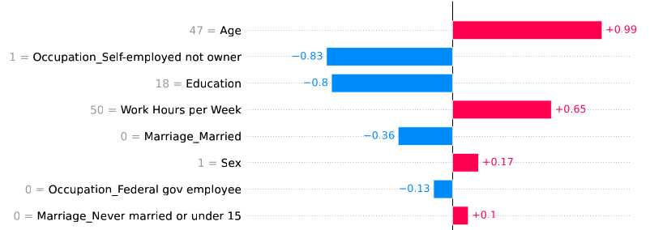
</div>

<div class="image-container">

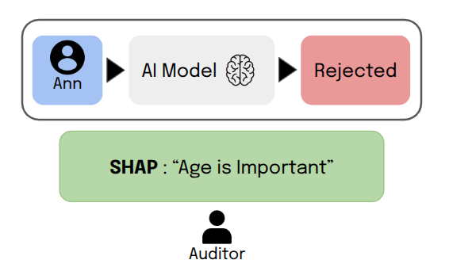
</div>

</div>

<br>

<div class="box-warning">
<div class="box-title">How much can we trust that explanation?</div>
</div>

---

<!-- _class: lead -->

## What If We Change Only How Age Is Represented?


<div class="two-col">

<div class="box">

<div class="box-title">Continuous Value Represenation</div>

*Age : 30*
```text
Rank #1         
SHAP = 0.99
```

</div>

<div class="box">

<div class="box-title">Bucket Value Representation</div>

*Age bucket : 25 - 35*
```text
Rank #5
SHAP = 0.37
```
</div>

</div>

<div class="box-note">

<div class="box-title">Note</div>

<b> No changes in Model or Explanation </b>

These numbers are directly from the paper's illustrative ACS Income example: continuous age vs 12-bucket equi-width encoding .

</div>

---

<!-- _class: lead -->

# The Core Problem

<div class="box-danger">

<div class="box-title">Concern</div>

*“An auditor wants to know whether an AI is using a protected attribute. SHAP seems to provide an answer. But if simply changing how that feature is represented can change its apparent importance, how reliable is that answer?”*
</div>

<div class="box-note">

<div class="box-title">The question</div>

But isn't SHAP supposed to explain the model?

What happens when we change how a feature is represented? Can this be gamed?

</div>

---

<!-- _class: lead -->

# SHAP

### Shapley values quantify each feature's contribution to a model prediction.
<br>

$$
\phi_i(f,x)
=
\sum_{S \subseteq N \setminus \{i\}}
\frac{|S|!(|N|-|S|-1)!}{|N|!}
\left[
f_x(S \cup \{i\}) - f_x(S)
\right]
$$

<div class="box">

<div class="box-title">Inference</div>

Feature contribution values for a particular prediction.

</div>

---

<!-- _class: section -->

# The Hidden Variable

## Feature Representation

The Feature is the same. The Representation is not.

---

<!-- _class: lead -->

## Continuous Features: Bucketization

<div class="two-col">

<div class="box">

<div class="box-title">Equi-Width</div>

Each interval has the same numerical width.

</div> 

<div class="box"> 

<div class="box-title">Equi-Depth</div>

Each interval contains roughly the same number of observations.

</div>
</div> 

<div class="image-container">

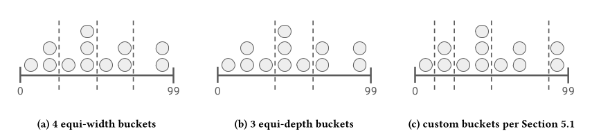
</div>

---

<!-- _class: lead -->

## Categorical Features: Encoding

<div class="two-col">

<div>

<div class="box">

<div class="box-title">Original Categories</div>

*One category → one representation*

We can encode categories individually, or change how categories are grouped or encoded.


</div>


<div class="box-warning">

<div class="box-title">Why does this matter?</div>

Same semantic attribute → different feature representation → potentially different SHAP explanation

</div>

</div>

<div class="image-container">

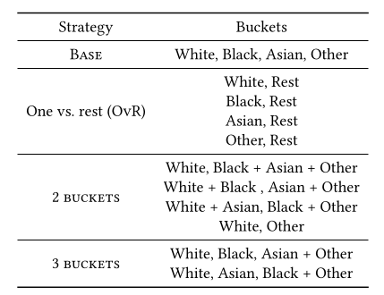

</div>

</div>

---

<!-- _class: lead -->

# Why Could Bucket Size Change SHAP?

<div class="box">

<div class="box-title">1. Bucket size changes the information available</div>

Smaller buckets preserve more of the original feature information.

Larger buckets <b>merge more values together</b>, making the representation coarser.

</div>

<div class="box">

<div class="box-title">2. SHAP works with that representation</div>

SHAP measures the feature's <b>marginal contribution</b> to the prediction.

When the representation changes, the contribution being measured can also change.

</div>

---

<!-- _class: lead -->

## From Sensitivity to Exploitability

<div class="two-col">

<div class="box">

**1. How sensitive are SHAP explanations to feature engineering?**

Does changing the feature representation  
change its apparent importance?

</div>

<div class="box">

**2.Can this sensitivity be deliberately exploited?**

Can a representation be chosen to reduce the apparent importance of a protected feature?

</div>

</div>

<div class="box">

**3. If the SHAP values change, are they still faithful to the original prediction?**
</div>

<div class="box-note">

<div class="box-title">Definition</div>
<b>Fidelity</b> : proportion of observations for which the explanation corresponds to the originally predicted outcome.

</div>

---

<!-- _class: section -->

# Inference from the Paper

## Experiments, Results & Key Findings

---

<!-- _class: lead -->

## The Experimental Setup

<div class="two-col">

<div class="box">

<div class="box-title">Datasets</div>

<b>ACS Income</b>

46,144 observations  & 8 features

<b>ACS Public Coverage</b>

25,524 observations & 16 features

</div>

<div class="box">

<div class="box-title">Model</div>

<b>XGBoost</b>

State-of-the-art ensemble classifier

Hyperparameter tuning  
for overall accuracy

</div>

</div>

<div class="two-col">

<div class="box">

<div class="box-title">Protected Features</div>

```text
Age 
Race
```

Both treated as protected features.

</div>

<div class="box">

<div class="box-title">Explanation & Evaluation</div>

- SHAP value
- SHAP rank
- Fidelity

</div>

</div>

---

<!-- _class: lead -->

## Finding #1: Age

<div class="image-container">

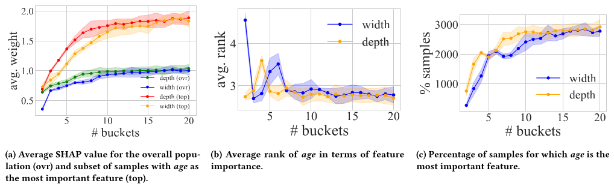
</div>

---

<!-- _class: lead -->

## Finding #1: Age


<div class="image-container">

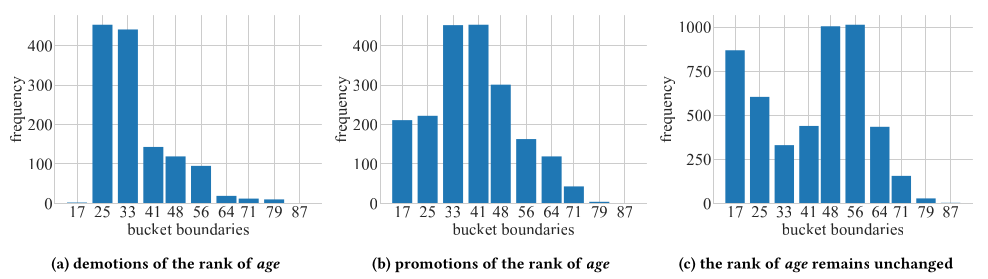
</div>

<div class="box">

<div class="box-title">Inference</div>
More buckets implies more importance
</div>

---

<!-- _class: lead -->

## Finding #2: Race

<div class="image-container">

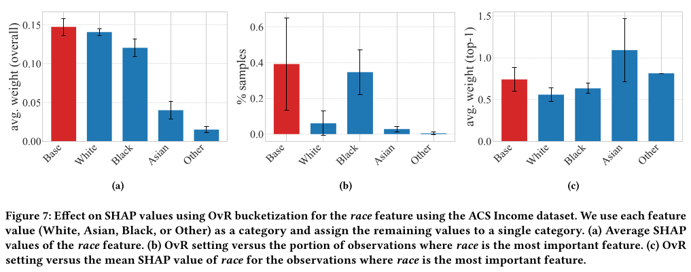
</div>

---

<!-- _class: lead -->

# Inference

<div class="box">
<div class="box-title">What we have seen</div>

Changing the <b>feature representation</b> can change the SHAP explanation.

</div>

<div class="box-danger">
<div class="box-title">The concern</div>

<b>If representation affects what the auditor sees,
could someone deliberately choose a representation to hide a feature's importance?</b>

</div>

---

<!-- _class: section -->

# Feature-Engineering Attack

## How Do You Hide a Feature From SHAP?

---

<!-- _class: lead -->

## Bayesian Optimization Can Hide Protected Features

<div class="two-col">

<div>

<div class="image-container">

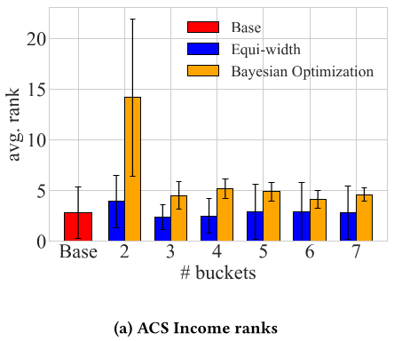
</div>

</div>

<div>

<div class="image-container">

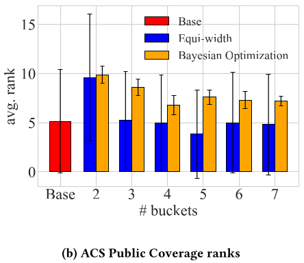

</div>

</div>

</div>

<div class="box">

**Bayesian Optimization (BO)** searches the representation space
for a transformation that satisfies both objectives.

</div>

---


<!-- _class: lead -->

## Bayesian Optimization Can Hide Protected Features

<div class="two-col">

<div>

<div class="image-container">

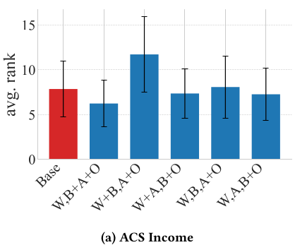
</div>

</div>

<div>

<div class="image-container">

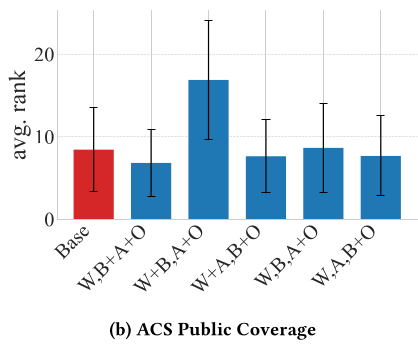

</div>

</div>

</div>

<div class="box-note">
<div class="box-title">What do we observe?</div>

Bayesian Optimization finds representations that push the protected feature to a lower SHAP importance .

$$
\boxed{
\min_{\tau \in \mathcal{T}}
-\operatorname{SHAP\_Rank}(a,f,D)
\quad
\text{s.t.}
\quad
\lambda > \epsilon
}
$$

</div>

---